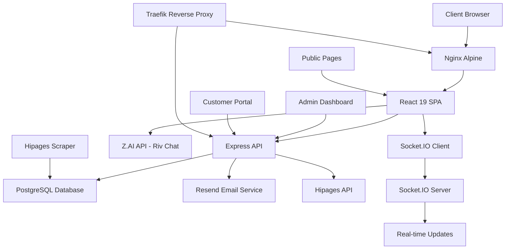

<!-- generated-by: gsd-doc-writer -->
# Architecture

## System Overview

Revive Property Co. is a full-stack property services management platform consisting of a React 19 + TypeScript frontend, Express.js backend API, PostgreSQL database, and integrated hipages lead scraper. The system provides public-facing service pages, an AI-powered chat concierge ("Riv"), customer portal for quote management, and an admin CRM dashboard for lead and appointment management. The architecture follows a layered design with client-side routing (HashRouter), RESTful API endpoints, real-time WebSocket communication via Socket.IO, and containerized deployment using Docker with nginx for static asset serving.

## Component Diagram



## Data Flow

### Typical Request Flow (Booking Page)
1. **User Interaction**: User navigates to `/book` route → HashRouter renders `BookingPage.tsx`
2. **Data Submission**: User submits booking form → `bookingApiService.ts` sends POST to `/api/bookings`
3. **API Processing**: Express route handler in `server/api/bookings.cjs` validates request
4. **Database Operation**: PostgreSQL transaction creates lead record and optionally appointment
5. **Response**: API returns success with created record ID → Client updates UI state
6. **Real-time Notification**: Socket.IO emits event to admin dashboard listeners

### Hipages Lead Sync Flow
1. **Scheduled Scrape**: Cron job triggers `hipages-scraper` service (every 6 hours)
2. **Authentication**: Service authenticates with hipages using credentials
3. **Lead Extraction**: Puppeteer-based scraper extracts available leads
4. **Database Storage**: Leads written to `hipages_leads` table in PostgreSQL
5. **Real-time Broadcast**: Socket.IO emits `hipages:new-lead` event to connected admin clients
6. **CRM Integration**: Admin can manually sync hipages lead to main CRM leads table

### AI Chat Concierge Flow
1. **User Message**: ChatWidget captures user input → `geminiService.ts`
2. **API Request**: POST to Z.AI endpoint (`https://api.z.ai/api/coding/paas/v4/chat/completions`)
3. **Model Inference**: GLM-4.7 model processes message with disabled thinking mode (<2500ms response)
4. **Context Management**: Service maintains 10-message sliding window conversation history
5. **Response Delivery**: Chat response displayed in widget with typing indicator

## Key Abstractions

### Frontend Components
- **Layout** (`components/Layout.tsx`): Main application wrapper with navigation and footer, wraps all routes
- **ProtectedRoute** (`components/ProtectedRoute.tsx`): Auth guard component for admin pages, checks Supabase auth session
- **CustomerProtectedRoute** (`components/CustomerProtectedRoute.tsx`): Auth guard for customer portal routes
- **ChatWidget** (`components/ChatWidget.tsx`): AI concierge interface with message history and typing indicators
- **CalendarPicker** (`components/CalendarPicker.tsx`): Date selection component for booking flow

### Backend Services
- **AuthContext** (`contexts/AuthContext.tsx`): Supabase authentication state management using React Context
- **CustomerAuthContext** (`contexts/CustomerAuthContext.tsx`): JWT-based customer authentication context
- **crmService** (`services/crmService.ts`): CRM operations (leads, appointments, tasks, campaigns)
- **customerService** (`services/customerService.ts`): Customer portal operations (profile, documents, quotes)
- **hipagesService** (`services/hipagesService.ts`): hipages lead fetching and CRM synchronization
- **geminiService** (`services/geminiService.ts`): Z.AI chat integration with context management
- **emailService** (`services/emailService.ts`): Email sending via Resend API

### API Routes
- **`/api/auth`** (`server/api/auth.cjs`): Admin authentication (login, logout, session verification)
- **`/api/customer`** (`server/api/customer.cjs`): Customer registration, login, profile management
- **`/api/bookings`** (`server/api/bookings.cjs`): Lead creation, booking management
- **`/api/crm`** (`server/api/crm.cjs`): CRM operations (leads, appointments, status updates)
- **`/api/hipages`** (`server/api/hipages.cjs`): hipages lead retrieval and CRM sync
- **`/api/customerDocuments`** (`server/api/customerDocuments.cjs`): File upload/download for customers
- **`/api/customerQuotes`** (`server/api/customerQuotes.cjs`): Quote approval/rejection workflow

### Database Schema (Key Tables)
- **leads**: Core customer leads with status tracking (NEW, CONTACTED, BOOKED, ARCHIVED)
- **appointments**: Scheduled quotes and jobs linked to leads
- **customers**: Customer portal accounts with authentication credentials
- **quotes**: Formal quotes with approval workflow (DRAFT, SENT, ACCEPTED, REJECTED, EXPIRED)
- **customer_documents**: File attachments uploaded by customers
- **hipages_leads**: Scraped leads from hipages platform with sync status

## Directory Structure Rationale

```
revivepropertyco/
├── components/          # Reusable UI components (Layout, ChatWidget, forms)
├── pages/              # Route components organized by feature
│   ├── admin/         # Admin-specific pages (HipagesLeadsNoAuthPage)
│   └── customer/      # Customer portal pages (Dashboard, Quotes, Documents)
├── contexts/          # React Context providers (Auth, CustomerAuth)
├── services/          # API client services (backend communication layer)
│   └── hipages-scraper/ # Standalone Puppeteer scraper service
├── server/            # Express.js backend
│   ├── api/          # RESTful API route handlers
│   ├── lib/          # Server utilities (hipages-sync, database helpers)
│   └── migrations/   # Database schema migrations
├── lib/              # Shared utilities (Supabase client initialization)
├── public/           # Static assets (images, robots.txt)
└── types.ts          # TypeScript type definitions (shared across frontend)
```

**Organization Principles:**
- **Component-driven UI**: Reusable components in `/components`, page-specific logic in `/pages`
- **Service layer pattern**: Frontend services abstract API calls, backend routes handle business logic
- **Separation of concerns**: Public pages, admin portal, and customer portal are distinct areas
- **Microservice architecture**: hipages scraper runs as independent containerized service
- **Shared types**: Single `types.ts` file ensures type consistency across frontend/backend

## Deployment Architecture

### Production Stack
- **Frontend**: Multi-stage Docker build → Nginx Alpine serving static files from `dist/`
- **Backend**: Node.js 20 Alpine container running Express on port 8080
- **Database**: PostgreSQL container (external homelab infrastructure)
- **Reverse Proxy**: Traefik handling HTTPS termination, routing, and WebSocket upgrades
- **Real-time**: Socket.IO server collocated with Express backend

### Networking
- **traefik-public**: External network for HTTPS traffic (Cloudflare TLS certificates)
- **homelab_web**: Internal network for web services
- **homelab_internal**: Isolated network for database and hipages scraper

### Key Deployment Features
- **Zero-downtime deployments**: Nginx serves old assets until new build completes
- **Health checks**: HTTP endpoint on port 80 for frontend, database connectivity for backend
- **Resource limits**: hipages scraper limited to 1 CPU core and 1GB RAM
- **Persistent volumes**: Customer uploads and hipages scraper output use Docker volumes
